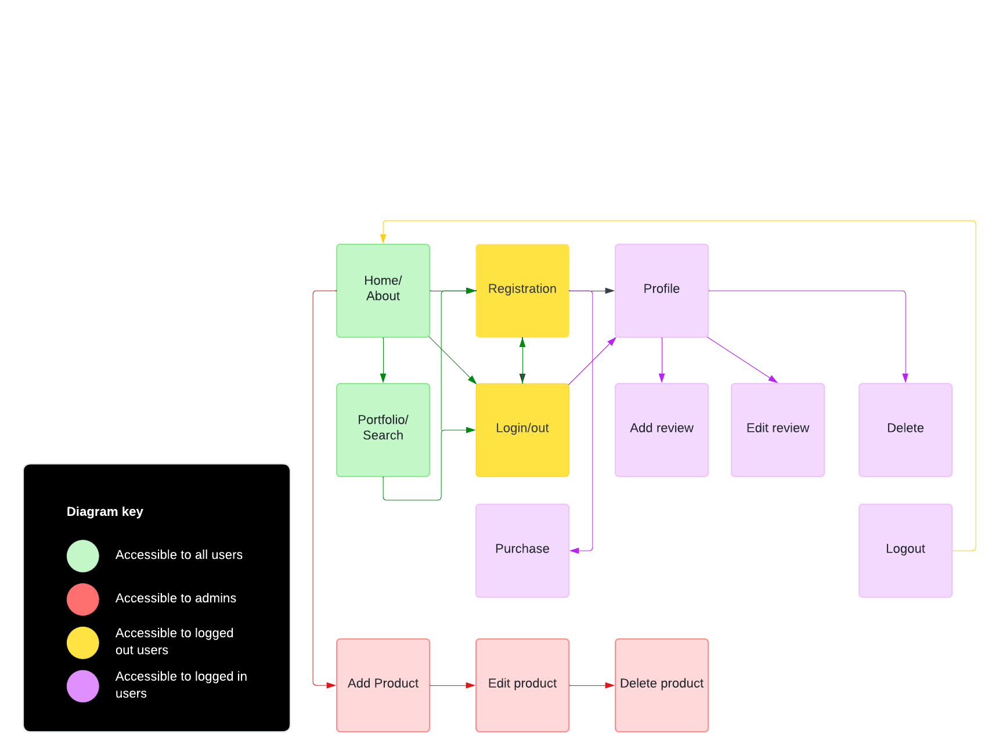

# Neon Bengal Photography

Neon Bengal Photography is a fullstack ecommerce application for an imaginary freelance photographer. This project was inspired by my first project for this certificate, Camera_and_Curls, and uses my own photography portfolio to create a shop where users are able to purchases prints. This project uses Django, HTML, CSS, JavaScript and Python and all data is stored in a PostgreSQL database via ElephantSQL

A link to the deployed site can be found [here](Insert heroku link here)

This application has been created for educational purposes only. No orders will be processed, charged or delivered. 

---

## Table of Contents

- [UX Design](#ux-design)
    - [Strategy](#strategy)
    - [Scope](#scope)
    - [Structure](#structure)
    - [Skeleton](#skeleton)
    - [Surface](#surface)
- [Features](#features)
- [Technologies](#technologies)
- [Testing](#testing)
- [Future Improvements](#future-improvements)
- [Deployments](#deployments)
- [Credits](#credits)

---

## UX Design

---

## Strategy

### Site goals

- The site's main aim is to provide users with a hassle-free shopping journey, from effortless navigation to secure checkout processes, ensuring a smooth and enjoyable ecommerce experience.

- The application also aims to present all photographs through in a visually appealing and intuitive design, enticing users to want to purchase prints. 

---

### User stories 

#### Viewing and Navigation

 | User Story  | As a     | I want to be able to...         | So that I can...                                                                     |
|---------------|----------|--------------------------------|--------------------------------------------------------------------------------------|
| 1             | Visitor  | Easily navigate the portfolio       | Explore different photographs and find prints that appeal to me                                         |
| 2             | Customer  | View products by category      | Find specific types of prints without having to scroll through all the items |
| 3             | Customer  | I want to view detailed information about each print  |  Make informed decisions before making a purchase                                                     |
| 4             | Customer  | View the items I have in my shopping bag| Check whether I want to purchase or amend the prints I've selected  |

#### Registration and User Accounts

| User Story ID | As a     | I want to be able to ...                     | So that I can...                                         |
|---------------|----------|---------------------------------------------|---------------------------------------------------------|
| 1             | Visitor  | Register an account                          | View my purchases and reviews        |
| 2             | Account holder  | Receive an email to confirm my registration  | Confirm my account creation was successful               |
| 3             | Account holder  | Log in and out                               | Secure my account information
| 4             | Account holder  | View a profile page                          | View my delivery address and review past orders  |
| 5             | Account holder  | Reset my password                            | Recover my account                                       |

#### Sorting and Searching 

| User Story | As a       | I want to be able to...                      | So that I can...                                      |
|------------|------------|---------------------------------------------|------------------------------------------------------|
| 1          | Customer   | Search for a product by name or description | Identify the product I want to buy quicker            |
| 2          | Customer   | See what I've searched for                   | View a selection of products specific to my needs     |

#### Review

| User Story ID | As a           | I want to be able to ...         | So that I can...                                                 |
|---------------|----------------|----------------------------------|-------------------------------------------------------------------|
| 1             | Account Holder | Read product reviews            | Find out what other customers think about the product            |
| 2             | Account Holder | Add a product review             | Share my experience using the product with other customers       |

#### Purchasing and Checkout

| User Story ID | As a     | I want to be able to...                                     | So that I can...                                                                         |
|---------------|----------|------------------------------------------------------------|-----------------------------------------------------------------------------------------|
| 1             | Customer | Select the quantity of a product when purchasing it | Add more than one of the same product if I wish
| 2             | Customer | View all items in my shopping cart                                    | To confirm that everything is added correctly
| 3             | Customer | Adjust the quantity of individual items in my bag           | Amend my purchase before checkout                                       |
| 4             | Customer | Enter my payment information                         | Check out my order in a seamless manner                                                    |
| 5             | Customer | Save my billing and shipping address                                      | Don't have to enter them when I place another order                                       |
| 6             | Customer | View an order confirmation after checkout                   | Make sure my order was successfully and check that all items are correct  |
| 7             | Customer | Save all orders on my Profile                               | Access all orders that I've placed on the app                                                       |
| 8             | Customer | Receive an email confirmation after checking out            | Verify that my purchase has gone through successfully

#### Contact 

| User Story ID | As a                | I want to be able to...   | So that I can...  |
|---------------|---------------------|---------------------------|-------------------|
| 1             | Customer/Account Holder/Visitor | Contact the admin team | Ask questions     |

#### Admin and Store Management

| User Story ID | As a   | I want to be able to... | So that I can...                            |
|---------------|--------|-------------------------|---------------------------------------------|
| 1             | Admin  | Add a product           | Add new items to the store                   |
| 2             | Admin  | Edit a product          | Update product details                      |
| 3             | Admin  | Delete a product        | Remove items that are not available  |
| 4             | Admin  | Delete a product review| Remove product reviews  |

---

## Scope

The table below shows all features of the site, detailing the user type, difficulty, and importance ratings. Prioritisation was based on these ratings during the build phase.

| User                | Feature                                                                | Difficulty | Importance |
|---------------------|------------------------------------------------------------------------|------------|------------|
| All users           | ElephantSQL database creation                                          |     5      |      5      |
| Visitors/Account holders | Contact form                                                         |      1      |      2      |
| All users           | Navigation                                                             |      1      |      4      |
| All users           | Portfolio page with search functionality                               |      5      |      4      |
| All users           | Detailed print/product description with ability to view customer reviews |      1      |      3      |
| All users           | Payment functionality allowing users to purchase prints                |      5      |      5      |
| All users           | Registration functionality                                             |      5      |      5      |
| Account holders     | Login/out functionality                                                |      5      |      5      |
| Account holders     | Profile page containing saved address information and previous orders  |      4      |      3      |
| Account holders     | Email notifications verifying successful account creation/purchase    |      4      |      4      |
| Account holders     | Account recovery                                                       |      5      |      5      |
| Account holders     | CRUD functionality                                                     |      3      |      5      |
| Account holders     | Stripe integration                                                     |      5      |      5      |

---

## Structure 

The site consists of 12 pages, including:

### Home and about
- Page detailing the purpose of the site with visually appealing carousel of various images 

### Registration 
- User sign-up form

### Login 
- User login form

### Profile 
- Users will land on this page once logged in, will show all saved personal information relating to purchases, previous orders and all reviews that user has left. 

### Portfolio/ search 
- Where users will be able to browse all photos available to purchase prints, will include a search functionality so that users can filter by category, description or name

### Purchase page 
- Where users can provide their payment information via a Stripe integration to purchase prints 

### Add review 
- Form to add review

### Edit review 
- Form to edit a review

### Delete recommendations 
- Seeks confirmation from user that they wish to delete a review

### Add product 
- Form for admin to add a print

### Edit product 
- Form for admin to edit a print

### Delete product 
- Seeks confirmation from admin that they wish to delete a product

